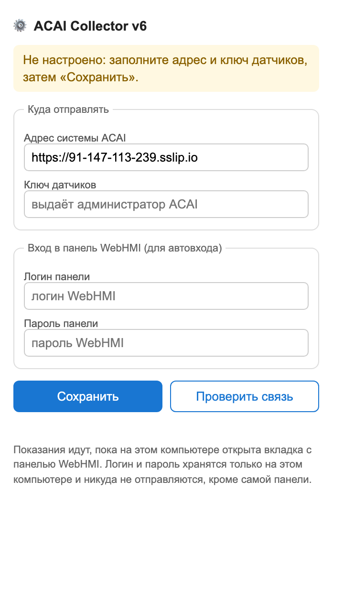
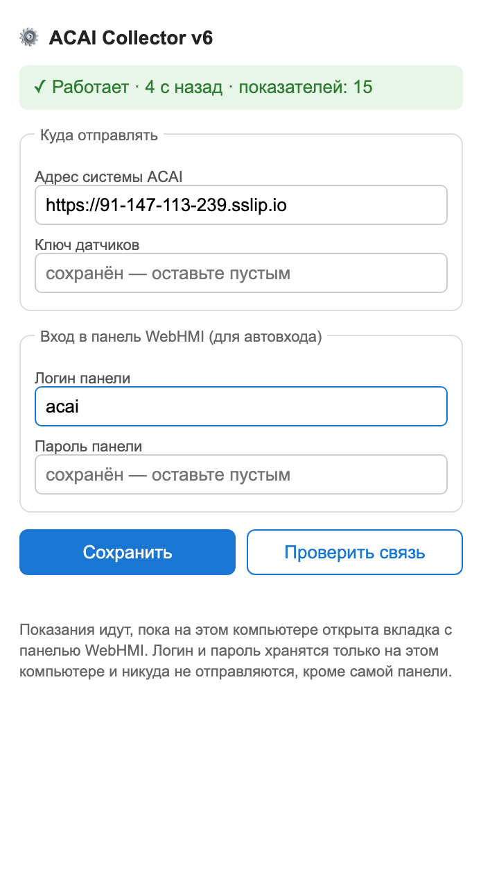
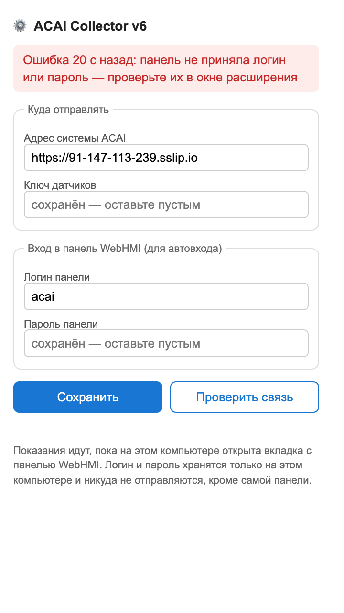

# Как поставить сбор показаний на заводской компьютер

Инструкция для того, кто будет ставить. Опыта не требуется, всё делается
мышкой. Занимает минут десять.

**Что понадобится заранее:**

1. Папка `webhmi-extension` — её пришлют или скопируют на флешку.
   Распаковывать архив, если он в архиве, **обязательно**: Chrome умеет
   ставить только из обычной папки.
2. **Ключ датчиков** — строка вроде `xJ8p…`. Её даёт администратор ACAI.
   По телефону или запиской, в инструкции её нет намеренно.
3. **Логин и пароль от панели WebHMI** — те самые, которыми открывают
   панель на этом компьютере.

---

## Шаг 1. Положить папку туда, где её не сотрут

Скопируйте папку `webhmi-extension` на диск C, например в
`C:\ACAI\webhmi-extension`.

> Не кладите её на рабочий стол и не оставляйте на флешке: Chrome
> обращается к этой папке при каждом запуске. Уберёте папку — сбор
> остановится молча.

## Шаг 2. Открыть список расширений Chrome

В адресной строке Chrome наберите:

```
chrome://extensions
```

и нажмите Enter.

В правом верхнем углу страницы включите переключатель
**«Режим разработчика»** (Developer mode). Без него кнопка из шага 3 не
появится.

## Шаг 3. Поставить расширение

Нажмите **«Загрузить распакованное расширение»**
(Load unpacked) — кнопка слева вверху — и выберите папку
`C:\ACAI\webhmi-extension`.

В списке появится плитка **ACAI WebHMI Collector 6.0**.

> Если на компьютере уже стоит старая версия (5.0) — удалите её кнопкой
> «Удалить» на её плитке. Две версии сразу работать не мешают, но старая
> не умеет сообщать, что панель разлогинилась, и путает картину.

## Шаг 4. Заполнить окно расширения

Нажмите на значок расширения (кусочек пазла справа от адресной строки →
**ACAI Collector**). Откроется окно:



Заполните четыре поля:

| Поле | Что вписать |
|---|---|
| **Адрес системы ACAI** | уже вписан: `https://91-147-113-239.sslip.io`. Менять не нужно |
| **Ключ датчиков** | строку от администратора ACAI |
| **Логин панели** | логин, которым входят в WebHMI |
| **Пароль панели** | пароль от WebHMI |

Нажмите **«Сохранить»**. Под кнопками появится «Сохранено на этом
компьютере».

Нажмите **«Проверить связь»**. Должно появиться зелёное
«Сервер ответил: связь есть, ключ принят».

- «Сервер не принял ключ датчиков» — ключ набран с ошибкой. Наберите
  заново, пробелы по краям не нужны.
- «Сервер недоступен» — нет интернета или адрес набран неверно.

> Логин и пароль хранятся только на этом компьютере, в хранилище Chrome.
> В файлах расширения их нет, на сервер ACAI они не отправляются —
> только в саму панель. Поэтому папку расширения можно спокойно
> копировать и хранить где угодно.

## Шаг 5. Открыть панель и оставить вкладку открытой

Откройте в этом же Chrome вкладку с панелью: `http://192.168.1.74`
и войдите в неё как обычно.

Через несколько секунд в окне расширения появится зелёная строка:



**Эту вкладку закрывать нельзя.** Пока она открыта, показания идут в
ACAI. Компьютер можно не выключать на ночь — тогда история будет без
дыр; если выключают, ночной перерыв система посчитает и покажет.

## Шаг 6. Проверить, что данные дошли

Откройте ACAI (`https://91-147-113-239.sslip.io`) на любом компьютере,
страница **«Сегодня»**. Вверху не должно быть жёлтой строки
«Данные с датчиков не поступают».

---

## Если что-то пошло не так

**В окне расширения красная строка «панель не приняла логин или пароль»**



Логин или пароль от WebHMI набран неверно. Впишите правильные и нажмите
«Сохранить» — расширение попробует снова.

Больше расширение подбирать не будет: оно специально прекращает
попытки, чтобы панель не заблокировала учётную запись. Это не поломка,
а защита.

**«Тишина 15 мин назад — вкладка с панелью закрыта или компьютер спал»**

Откройте вкладку с панелью заново. Заодно проверьте, что компьютер не
уходит в спящий режим: Параметры → Система → Питание и спящий режим →
«Спящий режим: никогда».

**Значок расширения пропал после перезапуска Chrome**

Папку `C:\ACAI\webhmi-extension` переместили или удалили. Верните её на
место и повторите шаг 3.

**Ничего не помогло**

Сообщите администратору ACAI: в системе видно, когда сбор прекратился и
на чём именно оборвался — «панель не отвечает» или «расширение не на
связи». Это разные неполадки, и по ним сразу понятно, кого звать.
